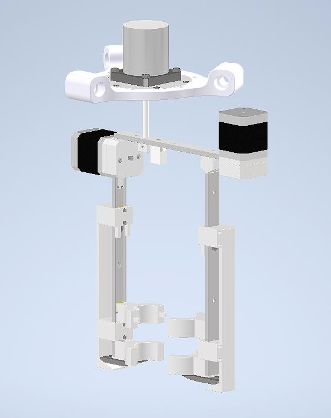
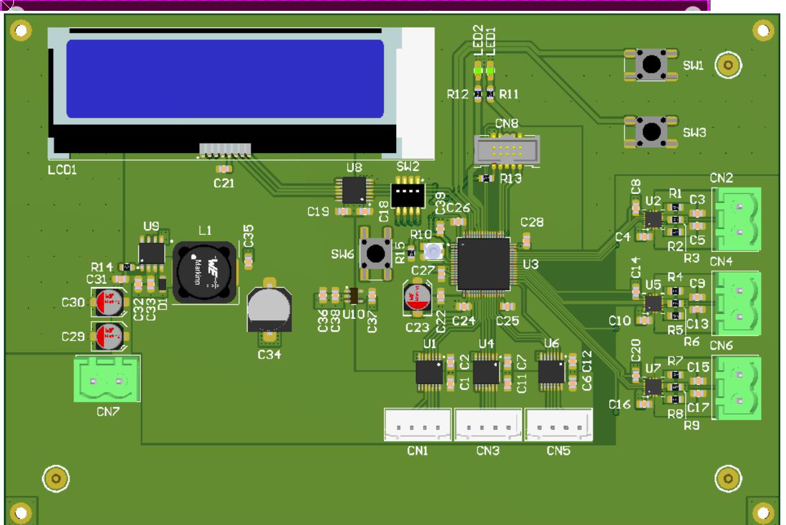

# Robotic Tool for Harvesting Stem Vegetables
Electromechanical end-effector tool for gripping and cutting stem vegetables (such as asparagus).  
Designed to be mounted on a delta robot for automated harvesting.

This project was created as part of the **Electro-Mechanical Product Design** course at the University of Ljubljana, Faculty of Electrical Engineering.

The repository includes a complete **mechanical design**, **electronics design**, and **system integration** of the end-effector.

---

## 1. Project Overview

The goal of this project was to design an end-effector capable of:

- Gripping a single stem vegetable from any direction  
- Stabilizing it during cutting  
- Cutting it in a horizontal plane  
- Attaching to a delta parallel robot  
- Staying within strict weight and size limits  

The final design includes a fully developed mechanical concept and a matching custom PCB designed for motor control and system interfacing.

---

## 2. Mechanical Design

### Key Features
- Four-arm cage gripping mechanism  
- Two fixed arms + two moving arms  
- Belt-driven horizontal and vertical motion  
- Height-triggered cutting mechanism (cams, ramps, springs, sliding blade)  
- Servo motor allowing 360° rotation  
- Designed to avoid unripe vegetables  
- Target mass: **< 700 g**

### Included Files
- Complete 3D CAD model (assemblies and components)  
- Exploded view  
- Mechanism simulation  
- Technical drawings  
- Bill of materials  

All mechanical files are located in:  
`/mechanical/`

---

## 3. Electronics Design

### Key Features
- STM32L476RG microcontroller  
- Three MP6619 H-bridge motor drivers  
- 24 V → 5 V DC/DC switching regulator  
- 5 V → 3.3 V linear regulator  
- Level shifter for encoder inputs  
- JTAG programming header  
- Status LEDs, DIP switches, potentiometer, push buttons  
- LCD display interface  
- Custom 2-layer PCB designed in Altium

### Included Files
- Full schematics  
- PCB layout  
- 3D PCB assembly  
- Gerber files  
- Custom component libraries

All electronics files are located in:  
`/electronics/`

---

## 4. Media

Images, renders, videos, mechanism animations, exploded views, and PCB 3D previews.

Stored in:  
`/media/`

---

## 5. Documentation

- Mechanical report (PDF)  
- Electronics report (PDF)  
- Technical drawings (PDF)

Located in:  
`/docs/`

---

## 6. Skills Demonstrated

### Mechanical Engineering
- CAD modeling and assemblies  
- Motion systems and kinematics  
- Mechanism and tool design  
- Component selection  
- Design for constraints (weight, geometry, material limits)

### Electrical Engineering
- Schematic design in Altium  
- PCB layout (routing, grounding, decoupling)  
- Motor driver circuitry  
- Power conversion (DC/DC and LDO)  
- Digital/analog interfacing  

### Systems Engineering
- Integrating mechanical and electronic subsystems  
- Error analysis and optimization  
- Documenting design workflows  
- Understanding system constraints and interactions

---

## 7. Future Improvements

- Reduce overall mass of the tool  
- Optimize motor selection and torque requirements  
- Improve PCB thermal performance  
- Add environmental and proximity sensors  
- Add end-stop switches for better motor homing  
- Integrate a small UPS to preserve state on power loss  

---

## 8. Repository Structure

vegetable-harvester-tool/
│
├── mechanical/
├── electronics/
├── media/
├── docs/
└── README.md

---

## 9. Author

**Aljaž Murovec**  
University of Ljubljana — Faculty of Electrical Engineering  
